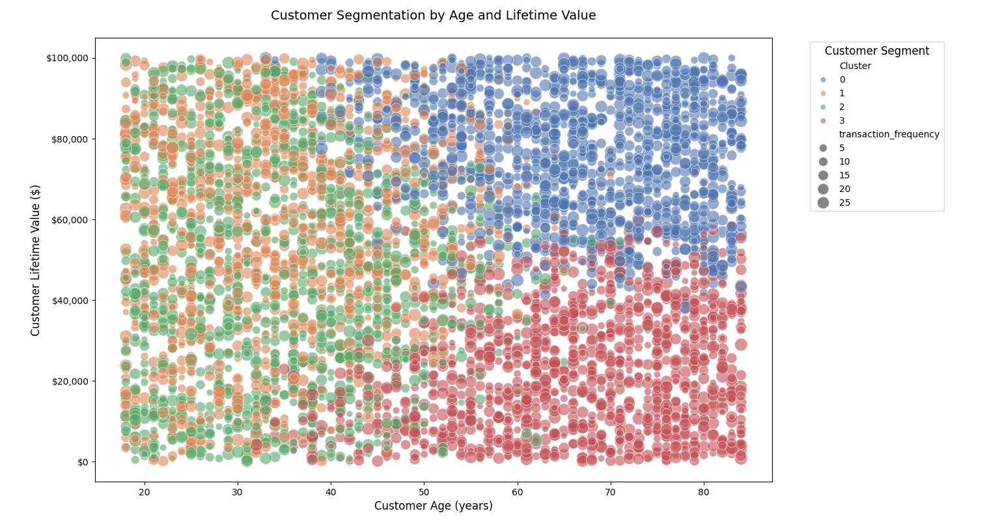

# Customer Segmentation

## Overview
This project focuses on customer segmentation, a technique used in marketing and business to divide a company's customer base into distinct groups. These segments can then be analyzed to tailor services, marketing strategies, and product offerings for specific customer needs.

## Features
- **Data Preprocessing**: Cleansing and transforming raw data for analysis.
- **Exploratory Data Analysis (EDA)**: Identifying trends, patterns, and relationships in the dataset.
- **Clustering Algorithms**: Implementing algorithms like K-Means to segment customers.
- **Visualization**: Creating visual aids to better understand and present the segmentation results.
- **Detailed Segment Profiles**: Providing comprehensive summaries of each customer segment.

## Requirements
Ensure you have the following installed:

- Python 3.8+
- Jupyter Notebook
- Libraries:
  - pandas
  - numpy
  - matplotlib
  - seaborn
  - scikit-learn

To install the required Python libraries, run:
```bash
pip install -r requirements.txt
```

## Dataset
The project uses a synthetic dataset containing customer details such as demographics, purchasing behavior, and spending habits. Ensure the dataset is placed in the appropriate directory before running the notebook. For this project, the dataset is named `customer_data.xlsx`.

## How to Run
1. Clone this repository:
   ```bash
   git clone <repository_url>
   ```
2. Navigate to the project directory:
   ```bash
   cd Customer_Segmentation
   ```
3. Open the Jupyter Notebook:
   ```bash
   jupyter notebook Customer_Segmentation.ipynb
   ```
4. Run the cells in sequence to execute the project.

## Code Workflow
### Data Preparation
1. Import necessary libraries and suppress warnings.
2. Read the dataset using `pd.read_excel()`.
3. Handle missing values in both numerical and categorical columns by filling them with mean or mode values respectively.
4. Select relevant numerical and categorical features for clustering.

### Preprocessing and Clustering
- Create a `ColumnTransformer` for preprocessing numerical and categorical features:
  - Scale numerical features using `StandardScaler`.
  - Encode categorical features using `OneHotEncoder`.
- Build a `Pipeline` with the preprocessor and `KMeans` clustering algorithm.
- Fit the pipeline to the data and predict clusters.

### Visualizations
The following visualizations are created to analyze and present the clustering results:
1. **Age vs Customer Lifetime Value Scatter Plot**: Visualizes clusters with transaction frequency as marker size.
2. **Feature Importance Heatmap**: Compares scaled mean values of numerical features across clusters.
3. **Transaction Patterns Box Plot**: Shows distribution of transaction volume by cluster and preferred transaction type.
4. **Income Distribution Stacked Bar Chart**: Highlights the percentage of income brackets within each cluster.
5. **Segment Size Distribution**: Displays the proportion of customers in each segment as a pie chart.

### Segment Profiles
For each segment, the following insights are summarized:
- Size and percentage of total customers.
- Average age and customer lifetime value.
- Average transaction volume.
- Most common income bracket and education level.

## Results
The notebook provides detailed insights into customer segmentation:
- Visualizations of clusters.
- Key characteristics of each customer segment.
- Recommendations for targeting different segments.

## Contributing
Contributions are welcome! If you have ideas or improvements, feel free to fork the repository and submit a pull request.

## License
This project is licensed under the MIT License. See the `LICENSE` file for details.

## Acknowledgments
- The dataset used in this project.
- Open-source libraries and frameworks.

## Contact
For any questions or issues, please contact:
- **Chirag Patankar**
- Email: [officialchiragp1605@gmail.com]
- GitHub: [ChiragPatankar]

## Visualizations

### 1. Age vs Customer Lifetime Value Scatter Plot


### 2. Feature Importance Heatmap


### 3. Transaction Patterns Box Plot


### 4. Income Distribution Stacked Bar Chart


### 5. Segment Size Distribution


